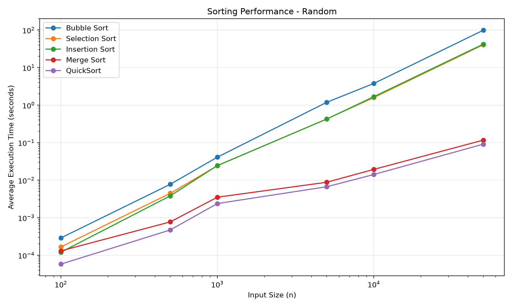
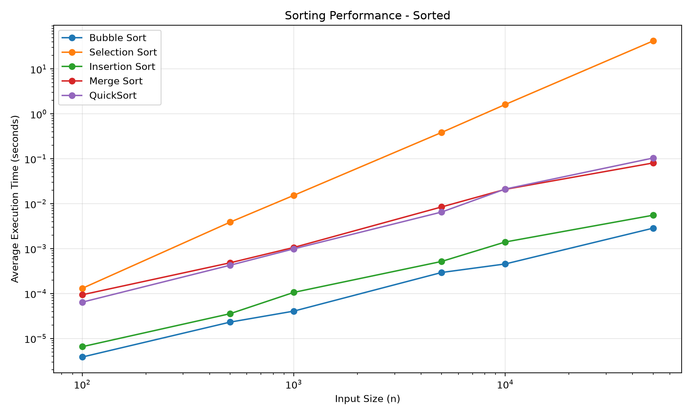
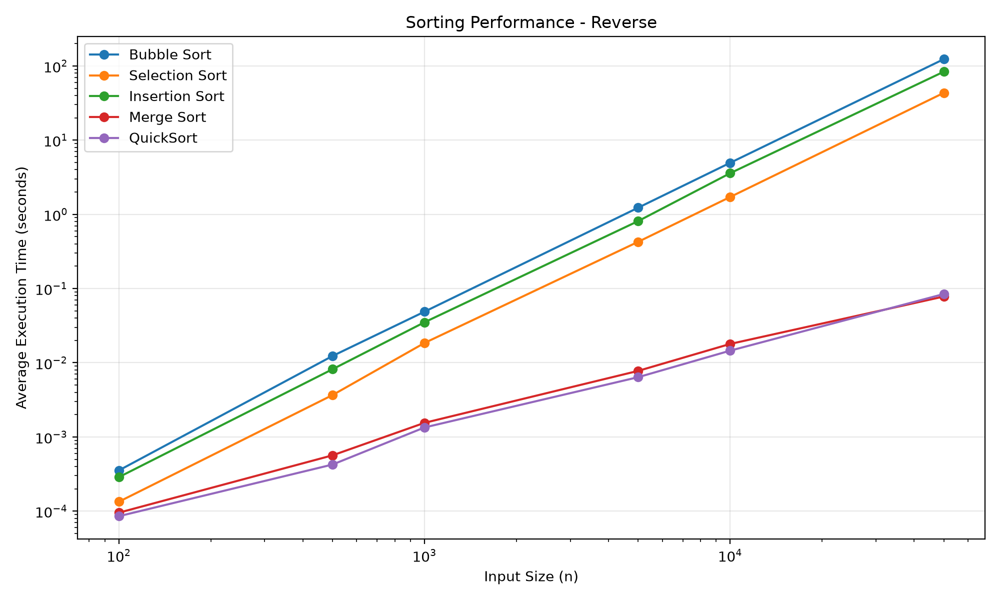
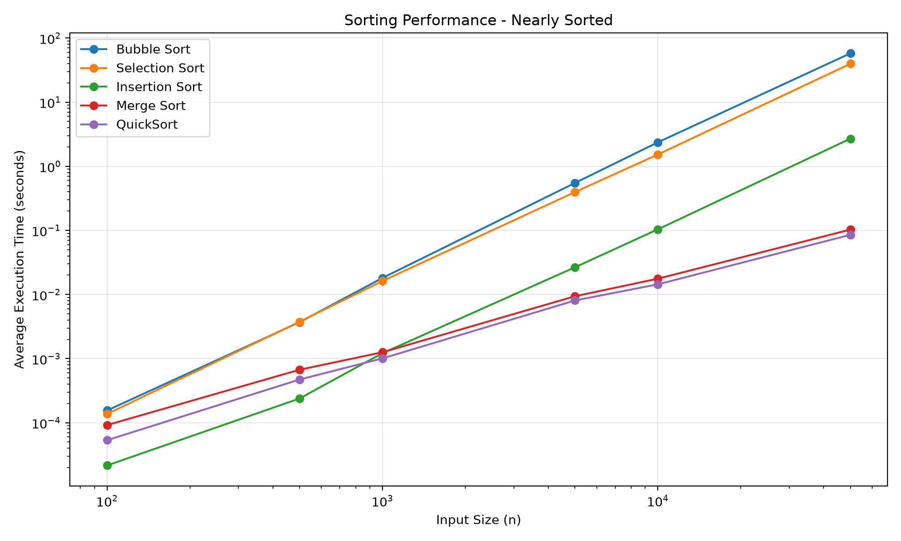
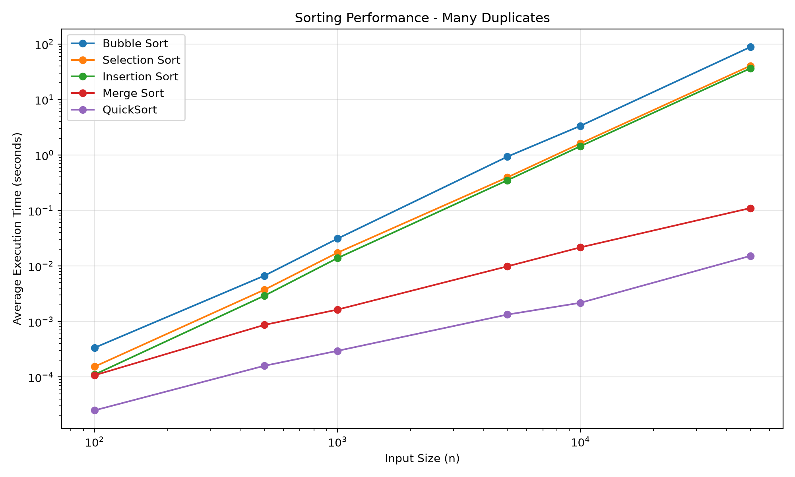
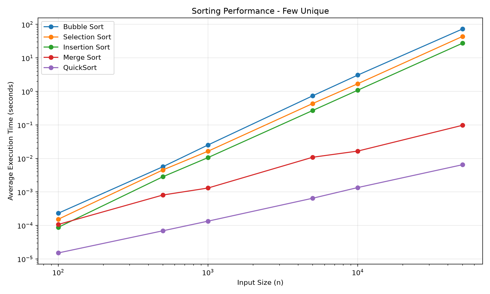

# Week 2 Performance Analysis Report

Jaymes McKenzie

GitHub Repository: https://github.com/jaymack0007/advanced-algorithms

---

## Summary

This week I compared Bubble Sort, Selection Sort, and Insertion Sort from Week 1 with Merge Sort (MS) and QuickSort (QS). As the input sizes got larger, the difference between the O(n²) and divide-and-conquer algorithms became obvious. MS and QS handled large inputs much faster, while Bubble Sort and Insertion Sort still did surprisingly well when the data was already sorted.

## Methodology

The benchmark tested all five algorithms using input sizes of 100, 500, 1,000, 5,000, 10,000, and 50,000 elements. I used six types of data: random, sorted, reverse sorted, nearly sorted, many duplicates with 10 unique values, and few unique values with only 3 unique values.

Testing was completed on Windows 11 Pro with an 11th Gen Intel Core i3 @ 3.00 GHz running Python 3.14.5. Inputs up to 1,000 elements used five timed runs, 5,000 used three runs, and 10,000 and 50,000 used one run. The runs were reduced at larger sizes because the O(n²) algorithms took much longer. The benchmark also checked the output to make sure each algorithm sorted correctly. The full run took over 15 minutes.

Results:

---

### Overall Performance Comparison

The table below shows the measured time in seconds at 50,000 elements.

|Data Type|Bubble|Selection|Insertion|Merge|QuickSort|
|-|-:|-:|-:|-:|-:|
|Random|98.504|40.473|41.997|0.117|0.091|
|Sorted|0.0029|42.083|0.0055|0.081|0.104|
|Reverse|123.216|43.294|83.524|0.078|0.084|
|Nearly Sorted|57.693|39.675|2.693|0.103|0.085|
|Many Duplicates|87.898|40.355|36.302|0.110|0.015|
|Few Unique|72.773|43.571|27.361|0.097|0.006|

The complete timing table is stored in `benchmarks/results/comparison_table.csv`.

## O(n²) vs O(n log n) Speedup Analysis

The difference was very noticeable at 50,000 elements. With random data, Bubble Sort took about 98.5 seconds while QS took about 0.091 seconds, making QS more than 1,000 times faster. MS finished the same test in about 0.117 seconds. Reverse-sorted data was even harder on the older algorithms. Bubble Sort took more than 123 seconds, while MS and QS both finished in under 0.1 seconds. At this size, the difference is a noticeable gap. Sorted data was the exception and Bubble Sort finished in about 0.0029 seconds while Insertion Sort finished in about 0.0055 seconds. Both beat MS and QS because the Week 1 versions can take advantage of data that is already ordered.

## Merge Sort Performance

MS was the most consistent algorithm in the test. At 50,000 elements, its times stayed between about 0.078 and 0.117 seconds across all six data types. The starting order made little difference, which fits the O(n log n) behavior discussed in the textbooks.

The downside is memory use; MS creates separate lists while splitting and merging, so it needs O(n) extra space.

## QuickSort Performance

QS was usually the fastest general-purpose algorithm in my results. The random pivot helped avoid the bad pivot pattern that can happen with sorted or reverse-sorted data; and I did not see the O(n²) worst case during the benchmark testing. I also used three-way partitioning, which made a huge difference with duplicate heavy data; With only three unique values, QS sorted 50,000 elements in about 0.0065 seconds; and with 10 unique values it took about 0.015 seconds. Because equal values are grouped together, QS avoids sorting them again in later recursive calls.

## Surprising Findings

The biggest surprise for me was how fast Bubble Sort and Insertion Sort were when the input was already sorted. Even at 50,000 elements, both finished in fractions of a second. Bubble Sort benefits from the early exit check, and Insertion Sort has nearly nothing to move when the list is already in order. Another interesting result was MS curve fitting; some data types came back looking closer to O(n), even though the theoretical complexity is still O(n log n). I think this happened because the measured times were close enough over the sizes tested that the curves appeared to be similar.

Complexity Validation:

---

### Merge Sort

The theoretical complexity of MS is O(n log n). On random data, the empirical analysis also selected O(n log n) as the best fit with an R² value of about 0.9996. From 5,000 to 10,000 random elements, the time increased from about 0.0088 seconds to 0.0194 seconds, or about 2.20 times.

### QuickSort

QS has an expected time of O(n log n) and a worst case of O(n²). On random data, the empirical analysis selected O(n log n) with an R² value of about 0.9995. From 5,000 to 10,000 random elements, the time increased by about 2.12 times. The worst case was not observed, which makes sense because the pivot was randomized. Three-way partitioning also helped when there were lots of duplicate values.

## Optimization Impact

QS switches to Insertion Sort when a subarray gets down to about 10 elements or fewer. This avoids some overhead on very small sections. Three-way partitioning had an even bigger effect in the duplicate tests. The Week 1 optimizations still were relevant here; Bubble Sort's early exit gave it an excellent best case on sorted input, while Insertion Sort continued to work well on sorted and almost sorted data.

## Practical Recommendations

For large general-purpose inputs, QS was the best choice in most of my tests. MS would be a good choice when consistent O(n log n) performance or stability is important. Insertion Sort still makes sense for smaller lists or data that is already close to sorted. Bubble Sort and Selection Sort are useful for learning and showing the evolution of sorting algorithms, but their O(n²) behavior makes them poor choices for larger inputs.

## Conclusion

The Week 2 benchmark made the difference between O(n²) and O(n log n) much easier to see than just reading the formulas. At smaller sizes, the gaps were small, but by 50,000 elements some of the older algorithms were taking tens of seconds or even more than two minutes; while MS and QS were still finishing in fractions of a second. Also, I learned that Big O is only part of the story. Input order and implementation choices matter too. Early exit helped Bubble Sort, random pivots protected QS from bad input order, and three-way partitioning made a major difference when the data had many duplicates.

## References

Amakobe, M. Chapter 2: Divide and Conquer. Course textbook.

Cormen, Leiserson, Rivest, Stein. *Introduction to Algorithms*, Fourth Edition.
