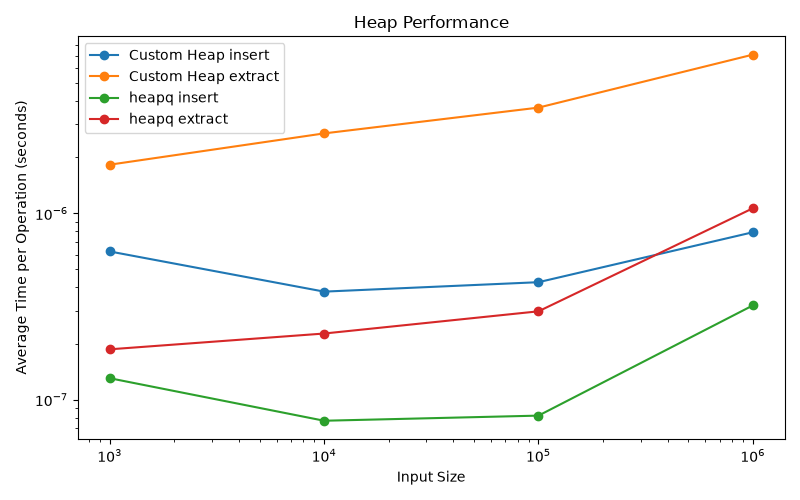
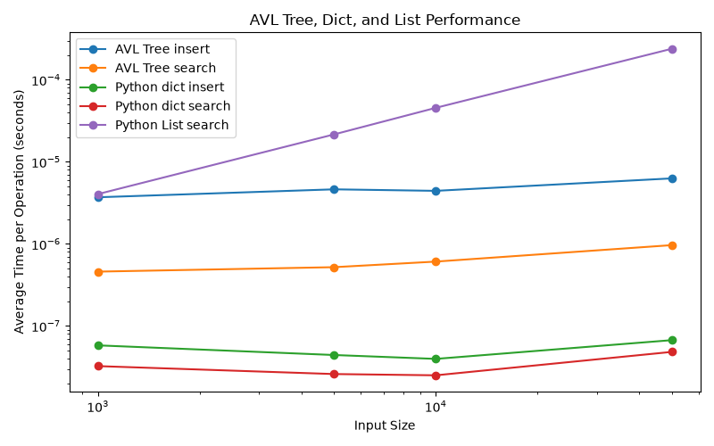
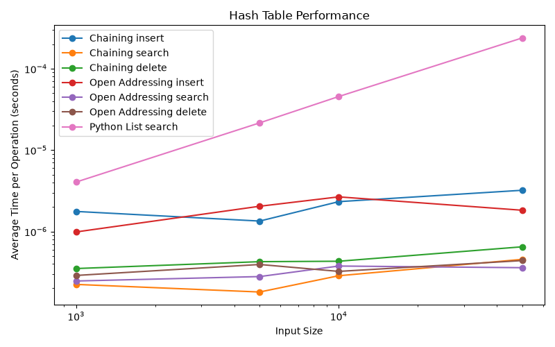
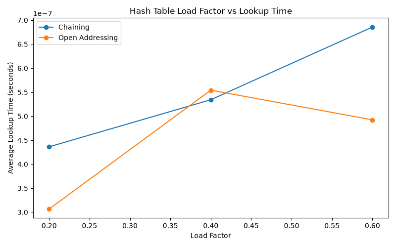

# Week 3 Data Structures Performance Report

Jaymes McKenzie

## Executive Summary

This week I implemented and tested a binary heap, AVL tree, and two hash table designs. The benchmark results showed that data structure choice has a major impact on performance; this becomes more evident as the input size grows. Hash tables provided the fastest lookup times, AVL trees had typical logarithmic behavior, and heaps handled priority operations well.

## Methodology

The tests were completed on Windows 11 Pro using Python 3.14.5, and the Week 3 project built on the benchmarking framework from Weeks 1 and 2. Each benchmark was repeated three times and the average time per operation was recorded using `time.perf_counter()`.

Per the criteria, the heap benchmark used input sizes of 1,000, 10,000, 100,000, and 1,000,000 elements. My custom min-heap was compared with Python's built-in `heapq` implementation for insertion and extraction.

The AVL tree benchmark used input sizes of 1,000, 5,000, 10,000, and 50,000 elements. The AVL tree was compared with Python's built-in dictionary for insertion and search. Python list search was also measured to show linear behavior.

The hash table benchmark used the same sizes as the AVL tree benchmark. Also, I tested separate chaining using linked lists and open addressing using linear probing. Insert, search, and delete operations were measured too; along with a second test measuring lookup performance at load factors of 0.20, 0.40, and 0.60.

All Week 1, Week 2, and Week 3 tests were also run together using pytest; with a total of 103 tests passed.

## Results

### Heap Performance

The custom min-heap showed the expected logarithmic increase in operation cost as input size increased. At 1,000 elements, average insertion time was about 0.41 microseconds per operation. At 1,000,000 elements, insertion increased to about 0.60 microseconds per operation.

Extraction increased more noticeably. At 1,000 elements, the custom heap averaged about 1.68 microseconds per extraction. At 1,000,000 elements, this increased to about 4.98 microseconds.

Python's `heapq` was consistently faster than my implementation i.e. at 1,000,000 elements, `heapq` averaged about 0.22 microseconds for insertion and 0.78 microseconds for extraction; this was expected because Python's standard library is highly optimized.

Nevertheless, the results still showed that the custom heap scales well and maintains the expected O(log n) behavior for insertion and extraction.

### AVL Tree Performance

The AVL tree also showed behavior consistent with logarithmic complexity; the average insertion time increased from about 2.98 microseconds at 1,000 elements to about 6.02 microseconds at 50,000 elements.

Search increased about three-fold from about 0.39 microseconds at 1,000 elements to about 1.06 microseconds at 50,000 elements.

Python's dictionary was much faster for both insertion and lookup; dictionary lookup remained close to constant time, ranging from about 0.02 to 0.06 microseconds across the sizes tested.

The list search provided an important comparison; list search increased from about 3.83 microseconds at 1,000 elements to about 250 microseconds at 50,000 elements. This clearly showed the difference between a linear search and the more efficient AVL and dictionary approaches. Lastly, the AVL tree maintained its balance by using rotations after insertions and deletions, which kept the tree height controlled and prevented it from degrading into a linear structure.

### Hash Table Performance

Both hash table implementations performed well across the tested sizes. Chaining and open addressing kept search and delete times in the microseconds range.

At 50,000 elements, chaining averaged about 0.42 microseconds for search and 0.63 microseconds for delete. Open addressing averaged about 0.39 microseconds for search and about 0.39 microseconds for delete.

The results showed that both collision-handling methods can provide fast average performance across the board. Open addressing was often slightly faster, although the difference depended on the operation and/or table size.

The separate load-factor benchmark showed that lookup time increased as the table became more full. For chaining, lookup time increased from about 0.50 microseconds at a 0.20 load factor to about 0.61 microseconds at 0.60.

Open addressing increased from about 0.34 microseconds at 0.20 to about 0.63 microseconds at 0.60; and this makes sense because higher load factors create more collisions and require more probing or linked list searching. 

## Amortized Analysis

Hash tables are a great example of amortized analysis since most insert operations are close to O(1), but occasionally the table must be resized and rehashed; this rehashing costs because all existing entries must be inserted into the new table.

Instead of treating every insert as expensive, amortized analysis spreads the cost of occasional rehashing across many inexpensive insert operations. This is why hash tables are still considered O(1) average case for insertions and lookups even though a resize can temporarily require O(n) work. 

The benchmark results support this; insert times remained small overall even though both hash tables automatically resized when their load factors reached their limits.

The load-factor test also showed why rehashing is important; as the table became more full, lookup times increased. Keeping the load factor controlled helps prevent performance from moving closer to the O(n) or worst case. 

### Overall Comparison

| Structure | Operation | Theoretical Complexity | Empirical Result |
|---|---|---|---|
| Binary Heap | Insert / Extract | O(log n) | Logarithmic growth |
| AVL Tree | Insert / Search / Delete | O(log n) | Logarithmic growth |
| Hash Table | Insert / Search / Delete | O(1) average | Near-constant average |
| Python List | Search | O(n) | Linear growth |
| Python dict | Insert / Search | O(1) average | Near-constant average |

## Practical Recommendations

Each data structure is useful for a different type of problem and knowing this before choosing is essential:

A binary heap is a good choice when an application needs repeated access to the smallest or largest priority item e.g. this includes task scheduling, priority queues, and shortest-path algorithms.

An AVL tree is useful when ordered data must remain searchable while also supporting insertion and deletion. Its balancing guarantees O(log n) search, insert, and delete performance. This makes it especially useful when predictable performance and sorted traversal are important.

Hash tables are the best choice when a fast key based lookup is the main goal and ordering is not required. Their average O(1) performance makes them useful for caches, indexes, lookup tables, and many database style operations.

There are also space and time trade-offs between these structures. Hash tables use extra table space to keep lookups fast, AVL trees store height and balance information in each node, and heaps use a compact array representation. In practice, systems can also combine structures when needed, e.g. using a hash table for fast lookup with a heap for priority based processing.

The results also showed that built-in Python structures are usually faster than custom implementations; however, the purpose of implementing these structures manually was not to outperform Python, but to understand how their internal design affects performance.

## Conclusion

Week 3 showed that the structure used to store data can be just as important as the algorithm operating on it. The benchmarks made the differences between logarithmic, constant, and linear behavior much easier to visualize.

Heaps provided efficient priority operations, AVL trees maintained balanced logarithmic performance, and hash tables provided the fastest average lookup times; and the list comparison showed how quickly linear search becomes more expensive as input size grows.

The biggest lesson from this week was that scalable systems depend on both good algorithms and appropriate data structures. Choosing the right structure can reduce the amount of work an algorithm has to perform and can make the difference between expected and good performance and low performance.

## References

Amakobe, M. Chapter 3: Data Structures for Efficiency. Course textbook.

Cormen, T. H., Leiserson, C. E., Rivest, R. L., & Stein, C. *Introduction to Algorithms* (4th ed.).

