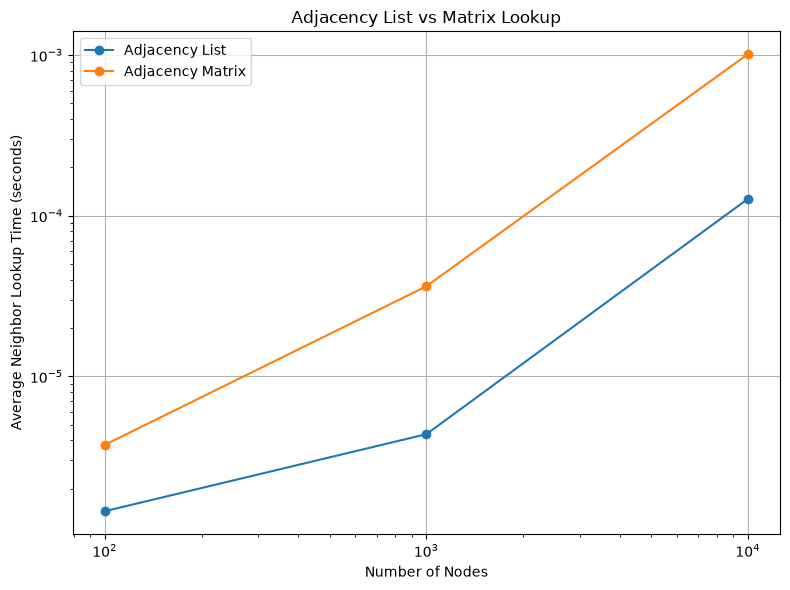
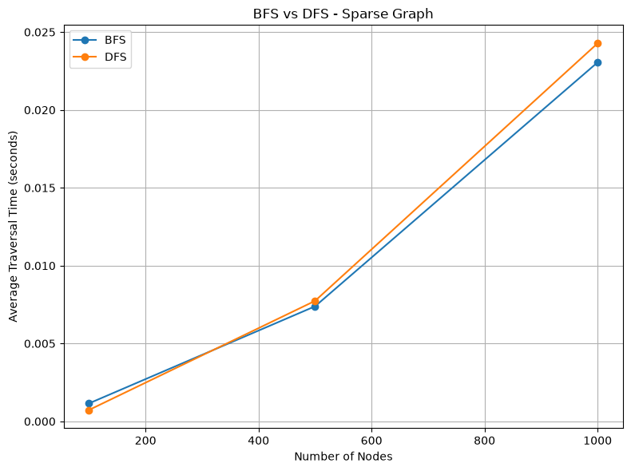
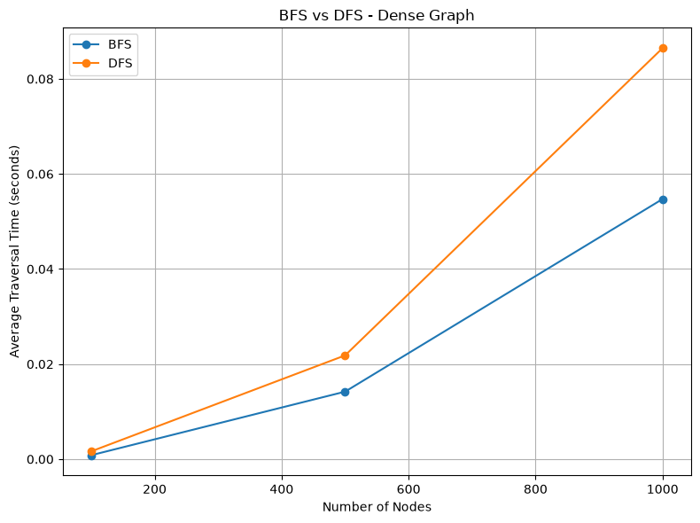
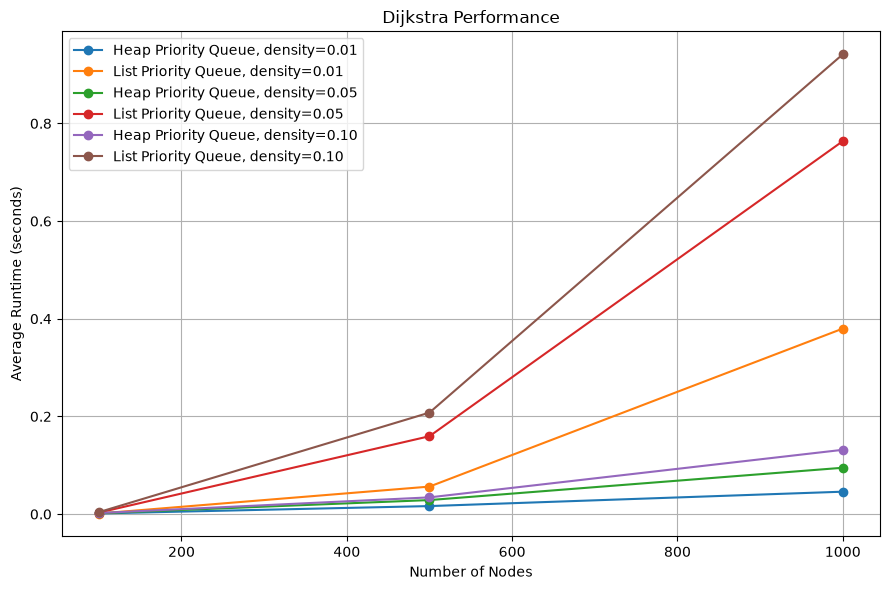
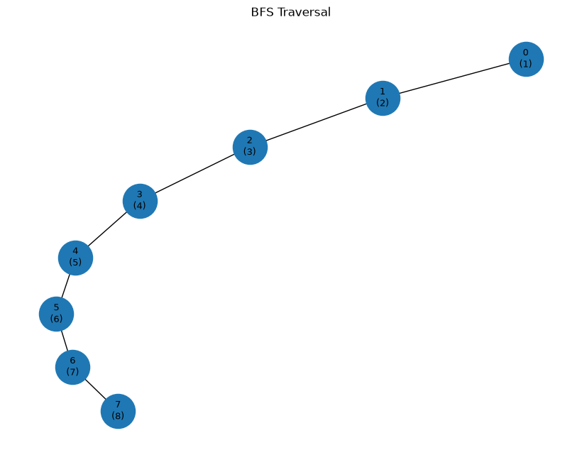

# Week 4 Graph Algorithms Performance Report

Jaymes McKenzie

## Executive Summary

This week I implemented and tested graph representations, traversal algorithms, and Dijkstra’s shortest path algorithm. The project included adjacency list and adjacency matrix representations, Breadth-First Search (BFS), iterative and recursive Depth-First Search (DFS), and Dijkstra using both heap-based and list-based priority queues. The benchmark results showed that graph structure and density have a major effect on performance. Adjacency lists used much less memory than adjacency matrices for sparse graphs, BFS and DFS both scaled with the number of vertices and edges, and the heap-based version of Dijkstra became much faster than the list-based version as graph size increased.

## Methodology

Testing was completed on Windows 11 Pro using Python 3.14.5 on an 11th Gen Intel Core i3 processor running at 3.00 GHz. The Week 4 project continued the same testing and benchmarking structure used in previous weeks. Pytest was used for correctness testing, while `time.perf_counter()` was used for runtime measurements. Each traversal and Dijkstra benchmark was repeated three times and the average was recorded.

The graph class supported directed and undirected graphs, weighted and unweighted edges, and both adjacency list and adjacency matrix representations. The adjacency list stored neighbors in dictionaries, while the adjacency matrix used bytearray rows to reduce memory overhead. Representation tests used sparse path graphs containing 100, 1,000, and 10,000 nodes. Neighbor lookup time and approximate representation memory were measured.

BFS and iterative DFS were compared on sparse and dense graphs containing 100, 500, and 1,000 nodes. Sparse graphs contained a basic connected path with a small number of additional edges. Dense graphs used a 0.25 edge probability. Runtime and peak additional memory were measured. Recursive DFS was also implemented and tested for correctness, but iterative DFS was used in the performance comparison so both traversal algorithms could operate safely on the larger test graphs.

Dijkstra was tested on weighted directed graphs using densities of 0.01, 0.05, and 0.10 with 100, 500, and 1,000 nodes. One version used the custom Week 3 min-heap and the second used a list-based priority queue. All graph and algorithm tests were run together with earlier coursework, resulting in 142 passing tests.

## Results

### Adjacency List vs Adjacency Matrix

The representation benchmark showed a large difference in memory use as graph size increased. At 100 nodes, the adjacency list used about 28 KB and the matrix used about 32 KB, so the difference was small. At 1,000 nodes, the list used about 270 KB while the matrix used about 1.18 MB. At 10,000 nodes, the list used about 2.62 MB while the matrix required about 101.62 MB.

This result matches the expected behavior of the two representations. A sparse adjacency list mainly stores existing edges, while an adjacency matrix reserves space for possible connections between every pair of nodes. The difference became much more important at 10,000 nodes, where the matrix used almost 39 times as much memory as the list.

Neighbor retrieval was also faster with the adjacency list in this sparse test. At 10,000 nodes, average neighbor lookup was about 0.000035 seconds for the list and about 0.000332 seconds for the matrix. In this implementation, matrix neighbor retrieval scans an entire row, while the adjacency list can directly return stored neighbors.

### BFS vs DFS

Both BFS and DFS performed well on sparse graphs. At 100 nodes, BFS averaged about 0.000218 seconds and DFS about 0.000278 seconds. At 1,000 nodes, BFS averaged about 0.00533 seconds and DFS about 0.00575 seconds. Their peak additional memory use was also very similar on the larger sparse graphs, at about 46 KB each.

The dense graph results showed a larger difference. At 1,000 nodes with a density of 0.25, BFS averaged about 0.01437 seconds while DFS averaged about 0.02230 seconds. Both algorithms still follow O(V + E), but the larger number of edges increased the amount of work required.

The memory results were especially noticeable for dense DFS. At 1,000 nodes, BFS used about 54 KB of peak additional memory, while iterative DFS used about 1.06 MB. This happened because the DFS stack could contain many pending neighbors at the same time in a dense graph. In contrast,
DFS used about 1.06 MB. 

This happened because the DFS stack could contain many pending neighbors at the same time in a dense graph. In contrast, BFS used a queue and marked nodes when they were added, which kept the number of pending entries lower in this particular dense graph. The result does not mean BFS will always use less memory than DFS, but it shows that graph structure and the implementation details can change the practical memory cost.

### Dijkstra Performance

Dijkstra showed the clearest advantage from using the Week 3 heap. At 1,000 nodes and a density of 0.01, the heap version averaged about 0.01345 seconds while the list version took about 0.09746 seconds. At density 0.05, the heap version took about 0.02234 seconds compared with 0.21448 seconds for the list version. At density 0.10, the heap version averaged about 0.03338 seconds while the list version required about 0.24545 seconds.

The performance gap became larger as the graph grew because the list-based priority queue has to search through its entries to find the smallest current distance. The min-heap handles this operation much more efficiently. The results therefore followed the expected advantage of using a heap for Dijkstra, especially when more vertices and edges must be processed.

Increasing graph density also increased runtime for both versions. More edges mean that Dijkstra must examine more possible paths and perform more distance comparisons. This is consistent with the expected O(E log V) behavior of the heap-based implementation.

## Discussion

The benchmarks showed that no single graph representation or traversal algorithm is best for every situation. Adjacency lists are a strong choice for sparse graphs because they only store existing connections. This is important for systems such as social networks or road networks, where a node is usually connected to only a small portion of all possible nodes. An adjacency matrix may still be useful when a graph is very dense or when direct edge-existence checks are important, but the memory cost grows quickly as the number of nodes increases.

BFS and DFS both have O(V + E) time complexity, but they explore a graph differently. BFS works level by level and is useful when finding the fewest edges between nodes in an unweighted graph. DFS follows one branch as deeply as possible before backtracking, which makes it useful for connectivity checks, cycle detection, and other problems where deep exploration is helpful. In my tests BFS was slightly faster, especially on the dense graphs, but that is an empirical result from these graphs rather than a rule that BFS is always faster.

Graph density also had a clear effect. The sparse 1,000-node graph took about 0.0053 seconds for BFS, while the dense graph took about 0.0144 seconds. DFS increased from about 0.0058 seconds to about 0.0223 seconds. Even with the same number of vertices, adding edges increases the amount of work required by both traversal algorithms.

These ideas have practical importance. Social networks can use graph traversal to discover connections, routing systems can use weighted shortest paths to choose efficient routes, and AI planning can represent states and possible actions as nodes and edges. The benchmark results show why the structure of the graph should be considered before choosing a representation or algorithm.

## Visualization Summary

The Week 4 visualizations made the performance differences easier to see. The sparse and dense BFS/DFS plots show that traversal cost increases more quickly as edge density rises. The Dijkstra plot shows the growing separation between the heap and list priority queues as graph size increases. The representation plot also shows the higher neighbor-retrieval cost of the matrix on the sparse path graphs.

A separate traversal diagram was generated using NetworkX and Matplotlib. The diagram labels nodes with their BFS traversal position, making the order of graph exploration visible instead of only displaying it as a list.

## Conclusion

Week 4 showed that graph performance depends on both the algorithm and the structure of the graph itself. Adjacency lists were much more memory efficient for sparse graphs, while adjacency matrices became expensive at larger sizes. BFS and DFS both followed the expected O(V + E) pattern, although their actual runtime and memory use changed with graph density.

Dijkstra also demonstrated the value of choosing the right supporting data structure. Reusing the Week 3 min-heap produced much better performance than searching a list for the next minimum-distance node. Overall, the project connected the theoretical complexity of graph algorithms with measurable behavior and showed why graph representation, density, and supporting data structures matter in real-world systems.

## References

Amakobe, M. *Advanced Algorithms* course textbook.

Cormen, T. H., Leiserson, C. E., Rivest, R. L., & Stein, C. *Introduction to Algorithms* (4th ed.).

