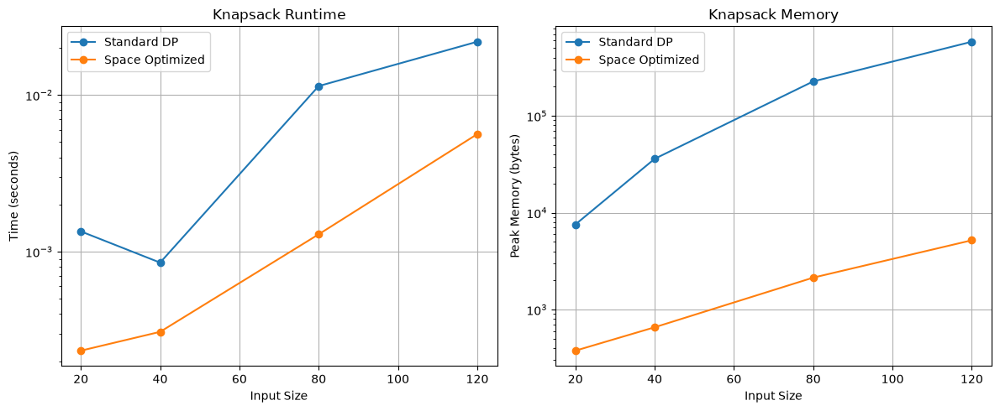
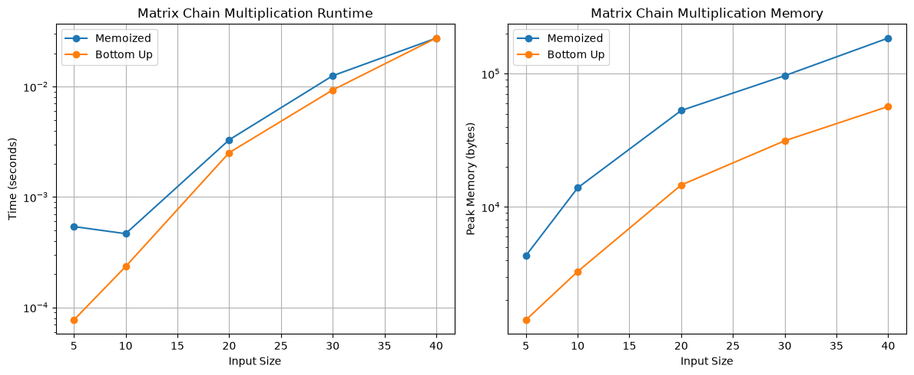
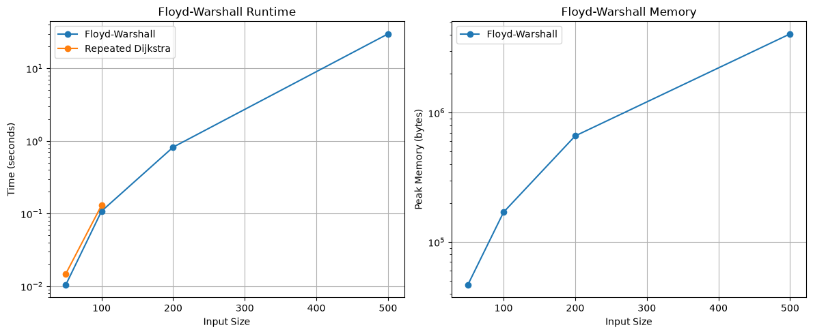
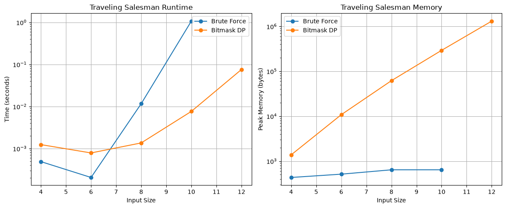

# Week 6 Advanced Dynamic Programming Performance Report

Jaymes McKenzie

## Executive Summary

Week 6 extended the dynamic programming work from Week 5 by focusing on memory use, state representation, interval problems, and graph problems. Four areas were tested: space-optimized 0/1 Knapsack, Matrix Chain Multiplication, Floyd-Warshall all-pairs shortest paths, and the Traveling Salesman Problem using bitmask dynamic programming.

The clearest improvement came from Knapsack. Replacing the two-dimensional table with a one-dimensional array greatly reduced memory use while preserving the same recurrence. At 120 items, the standard version used 583,336 bytes of traced peak memory, while the optimized version used 5,192 bytes. Floyd-Warshall showed the cost of cubic scaling, increasing from about 0.010 seconds at 50 vertices to 29.86 seconds at 500 vertices. Bitmask TSP also showed a large improvement over brute force. At 10 cities, bitmask DP took about 0.0076 seconds compared with 1.068 seconds for brute force, a speedup of about 140 times.

## Methodology

The project was developed and tested on Windows 11 Pro using Python 3.14.5 on an 11th Generation Intel Core i3 processor running at approximately 3.00 GHz. Pytest was used for automated testing. Pandas stored benchmark results, Matplotlib generated plots, and Python's `tracemalloc` module measured peak additional memory.

The Knapsack benchmark compared the Week 5 two-dimensional tabulation solution with a one-dimensional optimized version at 20, 40, 80, and 120 items. Both versions used the same deterministic data and were checked for matching answers.

Matrix Chain Multiplication was tested with 5, 10, 20, 30, and 40 matrices. A memoized top-down version was compared with a bottom-up DP version. Both returned the minimum scalar multiplication cost and an optimal parenthesization.

Floyd-Warshall was tested on directed weighted graphs with 50, 100, 200, and 500 vertices. Repeated Dijkstra runs from the Week 4 implementation were also measured on the 50- and 100-vertex graphs, and the resulting distances were checked for agreement.

The TSP benchmark used complete symmetric distance matrices with 4, 6, 8, 10, and 12 cities. Bitmask DP was tested across the full range. Brute force was measured through 10 cities and skipped at 12 because factorial growth makes direct enumeration increasingly impractical.

## Results

### Space-Optimized Knapsack

The one-dimensional Knapsack implementation produced the same optimal values as the standard version while using much less memory. At 20 items, the standard version used 7,560 bytes compared with 376 bytes for the optimized version. At 80 items, the difference was 227,024 bytes versus 2,136 bytes. At 120 items, standard DP used 583,336 bytes while the optimized version used 5,192 bytes.

The optimized version was also faster in every measured case. At 80 items it was about 8.84 times faster, and at 120 items it was about 3.89 times faster.

The correctness of the one-dimensional version depends on processing capacity from high to low. For each item, `dp\[w]` is updated using `dp\[w - weight]`. Moving backward ensures that the smaller-capacity value still represents the previous item set. If capacity were processed from low to high, the current item could be reused during the same iteration, which would no longer represent 0/1 Knapsack.

!\[Knapsack Space Comparison](../benchmarks/results/knapsack_space_comparison.png)

### Matrix Chain Multiplication

Both Matrix Chain Multiplication implementations followed the expected O(n^3) time and O(n^2) space behavior. Bottom-up DP was generally faster and used less traced memory. At 20 matrices, memoization took about 0.00329 seconds and used 52,909 bytes, while bottom-up DP took about 0.00252 seconds and used 14,612 bytes.

At 30 matrices, memoization took about 0.01254 seconds compared with 0.00931 seconds for bottom-up DP. At 40 matrices, their runtimes were almost identical: about 0.02746 seconds for memoization and 0.02751 seconds for bottom-up DP. Memory still differed, with 184,909 bytes for memoization and 56,724 bytes for bottom-up DP.

This shows that two algorithms with the same asymptotic complexity can still behave differently because memoization adds recursion and cache overhead.

!\[MCM Performance](../benchmarks/results/mcm_performance.png)

### Floyd-Warshall and Dijkstra

Floyd-Warshall showed clear cubic growth. Runtime increased from approximately 0.0104 seconds at 50 vertices to 0.1081 seconds at 100, 0.8236 seconds at 200, and 29.8573 seconds at 500. Peak traced memory increased from 46,552 bytes at 50 vertices to 4,064,808 bytes at 500 vertices.

For the smaller graphs, Floyd-Warshall was slightly faster than repeatedly running Dijkstra from every source vertex. At 50 vertices, Floyd-Warshall took about 0.0104 seconds compared with 0.0148 seconds for repeated Dijkstra. At 100 vertices, the times were about 0.1081 seconds and 0.1302 seconds.

This does not mean Floyd-Warshall is always faster. Its O(V^3) runtime applies regardless of graph density, while Dijkstra can benefit from sparse graph structures. Floyd-Warshall is useful when all-pairs distances are needed and also supports negative edges as long as there are no negative cycles.

!\[Floyd-Warshall Scaling](../benchmarks/results/floyd_warshall_scaling.png)

### Bitmask Traveling Salesman

The TSP results showed the value of state compression. At very small sizes, brute force was faster because it has little setup overhead. At 4 cities, brute force took about 0.00049 seconds while bitmask DP took about 0.00124 seconds.

The pattern changed as input size increased. At 8 cities, bitmask DP took about 0.00136 seconds compared with 0.01162 seconds for brute force, a speedup of about 8.56 times. At 10 cities, brute force took about 1.068 seconds while bitmask DP took about 0.00763 seconds, giving a speedup of about 140 times.

At 12 cities, brute force was skipped while bitmask DP still completed in about 0.0756 seconds. Bitmask DP used about 1.31 MB of traced peak memory at that size because it stores states for combinations of visited cities. This reflects its O(n x 2^n) space complexity, but it is still much more practical than factorial brute force.

!\[TSP Bitmask Runtime](../benchmarks/results/tsp_bitmask_runtime.png)

## Discussion

The Week 6 results show that dynamic programming is not only about avoiding repeated calculations. State design is equally important. Space-optimized Knapsack keeps only values that are still needed. Bitmask TSP represents a set of visited cities inside an integer. Matrix Chain Multiplication organizes states around intervals, while Floyd-Warshall treats each allowed intermediate vertex as another stage of the DP.

Space optimization is useful when a full DP table contains information that will never be needed again. Knapsack is a strong example because reducing space from O(nW) to O(W) did not change the O(nW) time complexity or the final answer. The trade-off is that compressed tables can make reconstruction and debugging harder because earlier states are discarded.

Bitmasking makes subset states compact and efficient, but bit operations are less readable than ordinary sets. This trade-off can still be worthwhile in routing, scheduling, and other problems where the state must record which choices have already been made.

These patterns also appear in practical applications. Interval DP can support expression and compiler optimization. Shortest-path algorithms are important in routing and network analysis. Dynamic programming ideas are also widely used in sequence comparison problems such as genome alignment.

## Conclusion

Week 6 moved from basic memoization and tabulation into more advanced DP design. Knapsack showed that careful iteration order can reduce memory from a two-dimensional table to one dimension. Matrix Chain Multiplication demonstrated interval DP. Floyd-Warshall applied DP to all-pairs graph paths, and bitmask TSP showed how compressed subset states can make a factorial brute-force problem much more manageable.

The benchmarks also showed that theoretical complexity does not describe every practical detail. Recursion overhead, memory allocation, graph density, and input size all affect measured performance. The best solution depends on both the mathematical structure of the problem and the available resources.

Overall, the progression from Week 5 to Week 6 showed that strong dynamic programming design comes from recognizing what information must be remembered, what can be discarded, and how each state can be represented efficiently.

## References

Amakobe, M. (2025). \*Advanced Algorithms: A Journey Through Computational Problem Solving\*. Chapter 6: Dynamic Programming, Sections 6.5-6.8.

Cormen, T. H., Leiserson, C. E., Rivest, R. L., \& Stein, C. \*Introduction to Algorithms\* (4th ed.).

